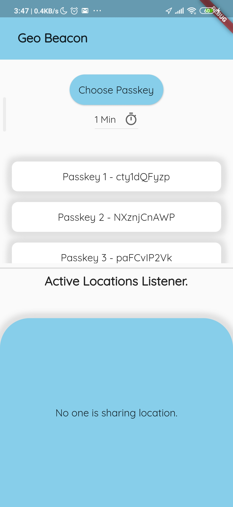
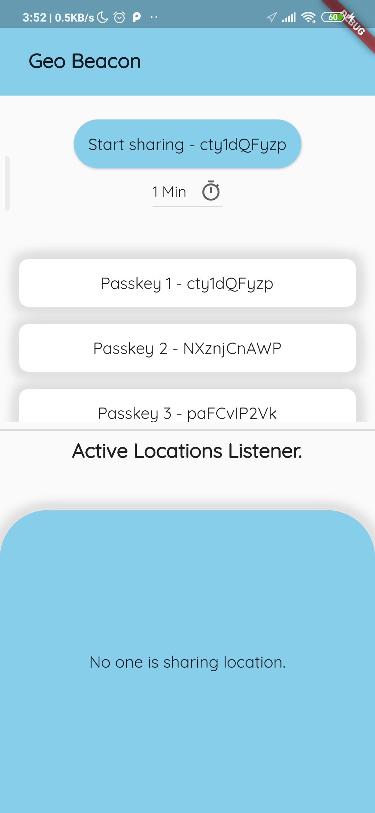
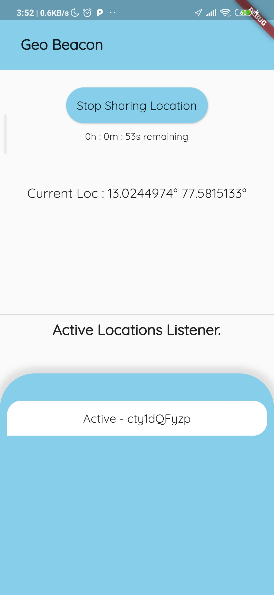
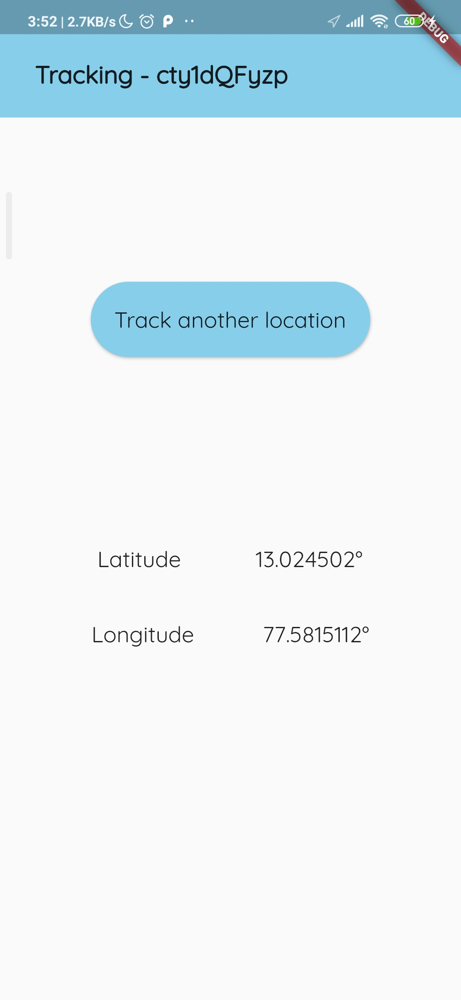

# geo_beacon_flutter


## How To Run?
 - Go to `/server/` and run the server.
```
node server.js
```
 - Make sure your phone and the computer you are running the server on are connected to the same network.
 
 - Check for the IPv4 address of the computer running the server using either `ipconfig`(Windows) or `ifconfig`(Linux) and
   add the same in `/lib/config.dart` in the `websocketServerUrl` field.
   
 - Now you can run the app on your phone using - 
 ```
 flutter run
 ```
 ## Screenshots
  
 
 Fig. 1 - Landing Page
 
  
 
 Fig. 2 - Choose Passkey
 
  
 
 Fig. 3 - Sharing Location
 
  
 
 Fig. 4 - Tracking Location
